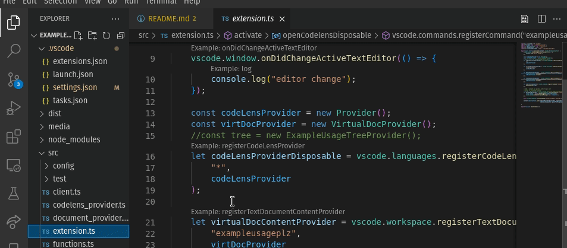
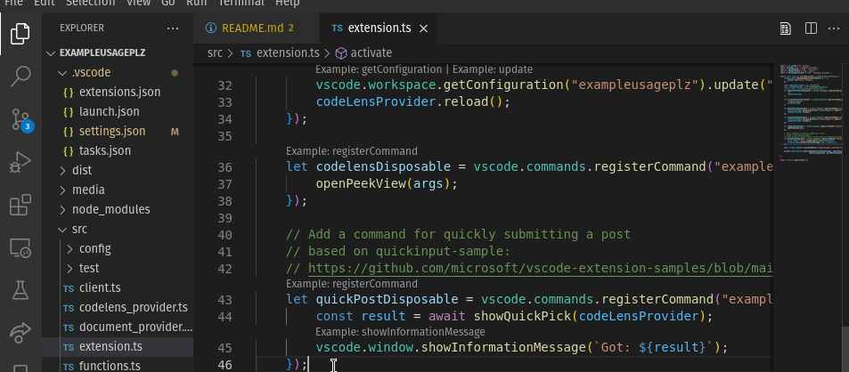

# exampleusageplz

## Table of Contents

- [Who We Are](#who-we-are)
- [Features](#features)
- [Getting Started](#getting-started)
- [Contributing](#contributing)
- [Project Structure](#project-structure)
- [How It Works](#how-it-works)


## Who We Are
### Founders
* Aiden Rutter (@argvrutter) is a masters student in Computer Science at the University of Tennessee, Knoxville. He's had internship and research experiences at places like Amazon and Oak Ridge National Lab, applying git workflow, agile, and test-driven development. 

* Justin Langston (@jlangst6) is a masters student in Computer Science at the University of Tennessee, Knoxville. He's had two internships at mastercard applying the agile methodology and techniques for the processing of large transaction batch files. 

* Racheal Dylewski (@rdylewsk) is also a master's student in computer science at the University of Tennessee, Knoxville. She has had internships and research experience at AT&T, Discovery, and UTK working with various subjects such as software defined networks, web and mobile development, and creating tools for developer productivity.

## Features

* Project explanation
    * *exampleusageplz* is a VSCode extension that helps developers by providing usage context of specific library/API calls. This greatly improves the information foraging process for specific library/API questions, which is critical for properly integrating other libraries/APIs effectively. The ability to get example usage is not novel, but *exampleusageplz* is unique in how it provides user curated usage context at the most detailed level of library documentation.

## Getting Started

### Backend
1. Check out the code
2. Install requirements (poetry install)
    Create a virtualenv
    pip install -r requirements.txt
3. Start the server with:
    ```
   flask run
    ```
4. Visit http://localhost/api for the home api

5. Visit http://localhost/apidocs for the swagger documentation

### Frontend
1. Code exampleusageplz
2. Start debug session with F5

3. Use command Get Usage To start code lens

## Contributing
* If you have an improvement or found a bug feel free to [open an issue](https://github.com/CS540-22/exampleusageplz/issues) or add the change and create a pull request. If you file a bug please make sure to include as much information about your environment as possible to help reproduce the issue. If you add a new feature please make sure to also include test cases for it.

## Project Structure
The system architecture consists of a backend with a *MySQL* database containing tables for user, content, API callee, and ratings data. There is a central web service to interface API requests for OAuth, users, and content between the database and frontend. In addition, the backend utilizes *World Of Code*, dispatching jobs to mine usage examples from relevant repositories over time or on demand. The frontend consists of a VSCode extension that scans the editor for calls, and allows examples to be accessed via the “Code lens” functionality. To rate or submit content, users must authenticate. Users can configure authentication via settings. The user can rate and browse contextually relevant code examples in a non intrusive manner. Users can submit posts by selecting code and using a context action in the editor.


## How It Works
The backend allows for CRUD operations on posts. These routes manage interactions with a MySQL database. Furthermore, the backend has basic search endpoints so that the VSCode client can retrieve any posts corresponding to a particular method and API.

The frontend is a VSCode extension that identifies eligible method calls as the user types. Of the eligible methods, a few will have code lens's appear to avoid being distracting. Users can interact with this to see a list of examples via 'peek mode'. See the figures below. 



Finally, users can make usage posts with the extension's 'quick post' feature. Users select a region of text and use a context (right click) menu and submit a brief form via the VSCode 'quick input' feature.



## List of Dependecy Packages (Backend/Development)

| Package | Description | Source |
| -- | -- | -- |
| flask | Python server of choice | https://palletsprojects.com/p/flask/ |
| flasgger | Used to generate the swagger documentation | https://github.com/flasgger/flasgger |
| flask-marshmallow | serializer of choice | https://flask-marshmallow.readthedocs.io/en/latest/ |
| apispec | Required for the integration between marshmallow and flasgger | https://apispec.readthedocs.io/en/latest/ |
| python-dotenv | reads key-value pairs from a .env file and can set them as environment variables | https://saurabh-kumar.com/python-dotenv/ |
| Flask-SQLAlchemy | an extension for Flask that adds support for SQLAlchemy to your application. | https://flask-sqlalchemy.palletsprojects.com/en/3.0.x/ |
| coloredlogs | enables colored terminal output for Python's logging module. | https://coloredlogs.readthedocs.io/en/latest/ |

## [License](./LICENSE)

<sub>[**back to top**](#table-of-contents)</sub>